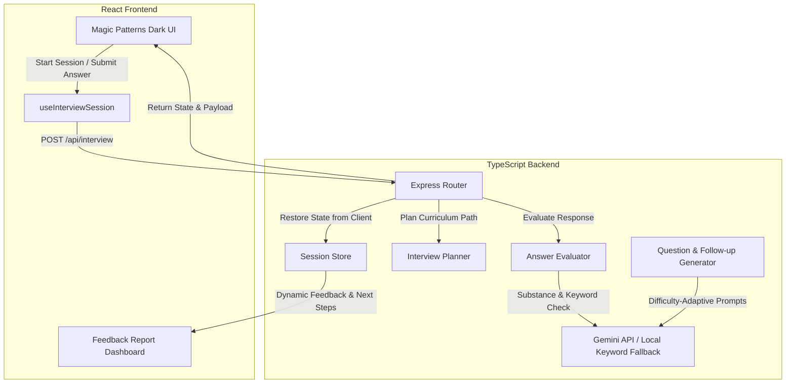

# ABTalks AI Cohort Interview Agent

An adaptive, intelligent technical interview platform designed to evaluate cohort candidates dynamically based on their progress through the 31-day AI engineering curriculum. 

The platform features a premium dark-themed user interface, dynamic difficulty scaling, custom visual neural branding, and a comprehensive automated testing suite.

---

## System Architecture

The Interview Agent bridges candidates' curriculum progress, real-time response evaluations, and adaptive next-step recommendations through a stateless and serverless-compatible design:



---

## Core Features

### 1. Adaptive Interviewing Engine
* **Dynamic Difficulty Alignment**: Interviews scale and calibrate question depth (Foundational, Intermediate, Advanced) based on candidate profile signals and answer correctness.
* **Curriculum-Aware Routing**: Ensures candidate evaluations cover at least 4 unique curriculum days and cross a minimum of 8 comprehensive questions.
* **Context Preservation**: Maintains complete conversation state to ask logical, cohesive follow-up questions without repeating previously explored topics.

### 2. Answer Evaluation & Feedback Engine
* **Substance Over Length**: Evaluates technical precision and concrete concepts (such as specific tool usage, scaling parameters, or memory limits) rather than simple response word count.
* **Question-Aware Keyword Analysis**: In rate-limit or API fallback scenarios, responses are graded against specific technical keywords customized to the question context (such as failover retry logic, Prometheus monitoring metrics, or vector database indexing architectures).
* **Granular Performance Metrics**: Generates scores across 5 primary dimensions: Technical Understanding, Problem Solving, Communication, Depth, and Practical Application.

### 3. Premium Enterprise UI & Brand Identity
* **Custom Geometric Neural Branding**: Features the BrandIcon component—an abstract neural head outline forming a speech bubble, housing a Y-branched connection map. Used consistently across the navbar, chat turn markers, and the pulsating AI evaluation indicator.
* **Dynamic Learning Links**: The "Review Topic" button on candidate feedback report cards routes the candidate directly to the Learning Progress dashboard, automatically highlighting the cohort module requiring reinforcement.

### 4. Serverless Session Persistence
* **Stateless Flow**: Designed to operate reliably in serverless environments (such as Vercel Serverless Functions) where backend instances are ephemeral.
* **Client-Side State Tracking**: The React client stores the latest session configuration state (`sessionState`) and passes it along with each successive `/api/interview` POST request.
* **Backend State Restoration**: The backend dynamically restores the session context prior to executing any evaluation or question-generation logic, ensuring complete state stability without requiring persistent database connections.

---

## Getting Started

### 1. Environment Setup
Create a `.env` file in the project root:
```env
PORT=5000
GEMINI_API_KEY=your_gemini_api_key_here
GEMINI_MODEL=gemini-2.5-flash
```

### 2. Install Dependencies
```bash
npm install
```

### 3. Start Development Server
Launches both the backend server (port 5000) and frontend bundler (Vite):
```bash
npm run dev
```

### 4. Build Production Assets
Compiles the frontend assets to the `dist/` directory and compiles the serverless backend function bundle:
```bash
npm run build
```

---

## Testing Suite

The project includes 67 automated test cases checking backend state rules, dynamic evaluation engines, and edge-case handling.

Run tests using:
```bash
npm test
```

### Coverage Highlights:
* **planner.test.ts**: Verifies dynamic cohort pathing, adaptive difficulty alignment, and candidate personalization rules.
* **feedbackEngine.test.ts**: Verifies qualitative performance summaries, strengths/gaps mapping, and dynamic next-steps selection.
* **fabricatedFeedbackBug.test.ts**: Ensures empty responses are blocked, incomplete sessions compile partial evaluations correctly, and session states do not leak between candidate switches.
* **concisenessPolish.test.ts**: Enforces word count thresholds, prevents chatty preambles, and runs semantic duplicate checks on generated questions.
